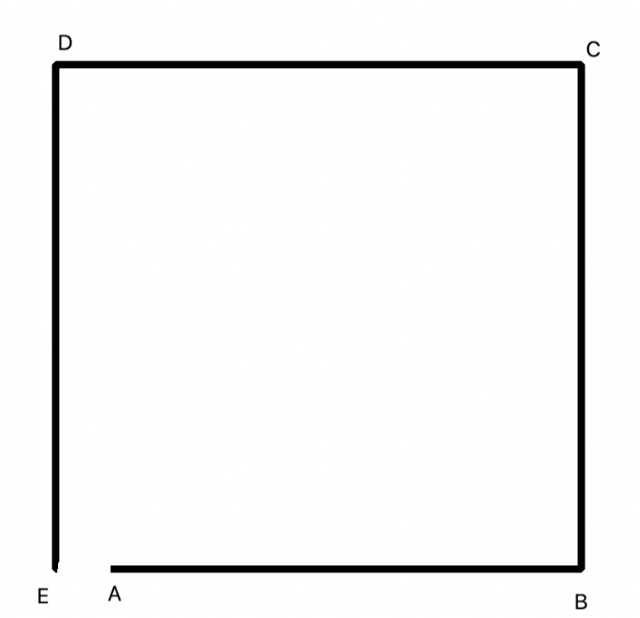

#Imagine you are on the equator. You go 1000 km to east then 1000km to north
then 1000km to west then 1000km to south. Assuming earth is a perfect
sphere and equator is 40000 km, how far from the original location (in
kilometers) are you?

##Prologue
I started by opening up Google Earth and selected the measure tool just to make sure there was a difference between the first and the last point when drawing a square on a sphere.
  / ! 
 Even if the measurement tool did not support right-angles and I had to try and place the points by hand, the resulting difference seemed big enough to verify the difference was real.
Also, this research lead me to believe that the difference would only be on the x-axis since there are east or west points and they are only directions relative to the top and bottom poles.

##Now for an attempt at geometry
  / ! 

First I calculate the equator radius :
	r = 40000 / (2 * pi) = 20000 /pi

Then I calculate the arc angle from that is created between C and B with the center of the earth as the angle point:
 aa(arc angle) = (1000km * 360) / 40000km = 9°

I imagine C -> D being an arc on a circle that's smaller and above the equator circle.
To calculate the smaller circles radius I use the law of sines:
rs/ sin(90 - 9 ) = 20000 / pi / sin(90) =>
rs / sin(81) = 20000/pi =>
rs = 20000 sin(81) /pi

Calculate the smaller circles circumference:
Cs =2* pi * rs
Cs = 2pi * (20000 * sin(81))/ pi
Cs = 40000 sin(81)

Calculate smaller circles arc angle:
aas = 1000 * 360 / 40000sin(81)
aas = 9 / sin(81)

Calculate arc length on equator circle with smaller circles arc angle:
EquatorArcLength = (9 /sin(81)) * (pi / 180) *(20000 / pi)
EquatorArcLength = 9.11218613758 * 0.01745329251 * 6366.19772368
EquatorArcLength = 1012.46512582

Finally calculate difference between the new arc length and the original walking distance
DistanceFromOrigianlPoint = 1012.46512582 - 1000 = 12.46512582
